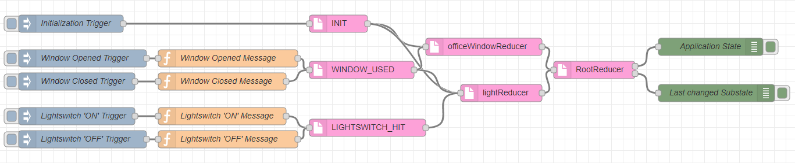

# Node Red Contribution: Reducere State Management

[](https://travis-ci.org/doemski/node-red-contrib-reducere)
[](https://badge.fury.io/js/node-red-contrib-reducere)

A State Management solution for [Node-RED](https://nodered.org/) heavily inspired by the popular JavaScript state container library [Redux](https://redux.js.org/). Just like in Redux, one consistent ('Single source of truth') application state is maintained in form of a JSON object.

This project was developed within the context of the [ProFi](http://prototyping4innovation.de/) research project funded by the German [Federal Ministry of Education and Research](https://www.bmbf.de/).

## Project status

This is an early but usable version which has been used for keeping a consistent state in a sizable scenario, where each of the components of the scenario communicated via MQTT. Bugs will probably occur. Most everything is subject for change, backwards compatibility is not the biggest concern at this stage.

## Installation

This assumes you have Node-RED already installed and working, if you need to install Node-RED see [here](http://nodered.org/docs/getting-started/installation).

Navigate to your Node-RED user directory:

```shell
# Windows default path
$ cd 'C:\Users\YOUR_USER_NAME\.node-red'

# Linux default path
$ cd ~/.node-red
```

Then install via [Node Package Manager](https://www.npmjs.com/):
```shell
$ npm install node-red-contrib-reducere
```
After the installation is complete restart Node-RED. There should be a new section 'Reducere State Management' in the Nodes-pane on the left.

## Future

If there is expressed interest in this project, the following list of features will be implemented:
- [ ] Proper testing
- [ ] Immutability checks for the substates and entire state
- [ ] Checks for side effects in Reducer functions
- [ ] In-project implementation for middlewares
- [ ] Better documentation
- [x] A working example flow for better understanding

## Included nodes
Currently three nodes are included in this project:
- ActionCreator
- Reducer
- RootReducer

An explanation and example is given below. To obtain a better understanding for the concept behind a specific node please refer to the Redux documentation.

### ActionCreator
Node that receives an event message and outputs an action.

#### Example
Possible received event message when a user hits a light switch:
```js
{
  topic: "state/lightSwitch",
  payload: {
    lightSwitchStatus: "on"
  },
  _msgid: "6f907ddb.fdf2c4"  
}
```

Output action:
```js
{
  type: "LIGHTSWITCH_ACTIVATED",
  status: "on"
}
```

#### Fields
- __Name__: The name shown in the Node-RED workplace.
- __Type__: The identifying type of the action. Choose a unique name that is descriptive of the event that occurred (E.g. LIGHTSWITCH_ACTIVATED).
- __Data Source__: The name of the field in the incoming message's payload that contains the relevant data of the occurred event (E.g. 'lightSwitchStatus', which could contain the values 'on' or 'off').

### Reducer
A node that takes an action and a current substate and returns a new substate.

**Note**: It is recommended to have an ActionCreator which creates an initialization action ('INIT') at the start of the application. This way the Reducer can return the initial substate it is responsible for.

#### Example
Possible initial state of a reducer:
```js
{
  color: "red",
  status: "off"
}
```
Possible reducer function:
```js
const reduce = (state, action) => {
  switch (action.type) {
    case 'INIT':
      return state;
    case 'LIGHTSWITCH_ACTIVATED':
      const newLightSwitchStatus = action.status;

      const updatedState = {
        ...state,
        status: newLightSwitchStatus
      }
      return updatedState;
    default:
      return state;
  }
}
```

#### Fields
- __Name__: The name shown in the Node-RED workplace.
- __Initial State__: The initial state of the substate this reducer is responsible for (E.g. {color: "green", status: "off"}).
- __Substate__: The name of the substate this reducer is responsible for (E.g. "light").
- __Function__: The actual reducer function that determines the new state.

### RootReducer
A node that combines all Reducer nodes and sends out the full state on Output 1 and the current substate on Output 2. This way the relevant part of an application can simply listen to changes to the slice of the state that it is concerned with.

Simply route all the outputs of your Reducer nodes into the RootReducer's input. No further configuration is required.

#### Example
Possible full state for a simple IoT scenario:
```js
{
  light: {
    color: "green",
    status: "off"
  },
  officeWindow: {
    open: "false"
  }
}
```
Each of the substates (light, officeWindow) are provided by a Reducer node.
#### Fields
- __Name__: The name shown in the Node-RED workplace.

## Sample Flow

The below flow implements a(n unrealistically) simple IoT scenario with a window, an RGB light and a light switch. If the window is open the light turns red, else it is green. The user can turn the light on/off.

In this sample the incoming events are mocked by Node-RED injects and the RootReducer's outputs are simply logged to the debug pane. In a real scenario the messages could be received and sent via MQTT. This way, parts of your application could either listen to changes of a specific piece of substate or the entire state.



```json
[{"id":"42873db5.643224","type":"Reducer","z":"8c83df46.6915c","name":"officeWindowReducer","initialState":"{\"open\": false}","substateName":"officeWindow","func":"const reduce = (state, action) => {\n\tswitch (action.type) {\n\t\tcase 'INIT':\n\t\t\treturn state;\n\n\t\tcase 'WINDOW_USED':\n\t\t    /*\n\t\t        \"Translate\" your data here if the data of the incoming events is\n\t\t        represented in another way than you want to keep it in the \n\t\t        state tree. Make sure to not manipulate the current state but\n\t\t        create a new object instead.\n\t\t        (See: https://redux.js.org/recipes/structuringreducers/immutableupdatepatterns)\n\t\t    */\n            const newWindowState = action.newWindowState;\n            let updatedState;\n            \n            if(newWindowState === 'open') {\n                updatedState = {\n                    open: true\n                };\n            } else if(newWindowState === 'closed') {\n                updatedState = {\n                    open: false\n                };\n            } else {\n                return state;\n            }\n            \n            return updatedState;\n\n\t\tdefault:\n\t\t\treturn state;\n\t}\n}","x":840,"y":340,"wires":[["c43a5a34.853c18"]]},{"id":"c43a5a34.853c18","type":"RootReducer","z":"8c83df46.6915c","name":"RootReducer","x":1030,"y":380,"wires":[["84322a23.d87dd8"],["1980a700.37d349"]]},{"id":"b88e83b9.41746","type":"ActionCreator","z":"8c83df46.6915c","name":"INIT","actionType":"INIT","dataSource":"","x":590,"y":300,"wires":[["42873db5.643224","cdcf1c4e.86a74"]]},{"id":"9767c4d.eed4538","type":"inject","z":"8c83df46.6915c","name":"Initialization Trigger","topic":"","payload":"","payloadType":"date","repeat":"","crontab":"","once":false,"onceDelay":0.1,"x":130,"y":300,"wires":[["b88e83b9.41746"]]},{"id":"84322a23.d87dd8","type":"debug","z":"8c83df46.6915c","name":"Application State","active":true,"tosidebar":true,"console":false,"tostatus":false,"complete":"true","x":1230,"y":340,"wires":[]},{"id":"1980a700.37d349","type":"debug","z":"8c83df46.6915c","name":"Last changed Substate","active":true,"tosidebar":true,"console":false,"tostatus":false,"complete":"true","x":1240,"y":420,"wires":[]},{"id":"cdcf1c4e.86a74","type":"Reducer","z":"8c83df46.6915c","name":"lightReducer","initialState":"{\"color\": \"green\", \"status\": \"off\"}","substateName":"light","func":"const reduce = (state, action) => {\n\tswitch (action.type) {\n\t\tcase 'INIT':\n\t\t\treturn state;\n\n\t\tcase 'WINDOW_USED':\n            const newWindowState = action.newWindowState;\n            let updatedState;\n            \n            if(newWindowState === 'open') {\n                updatedState = {\n                    ...state,\n                    color: 'red'\n                };\n            } else if(newWindowState === 'closed') {\n                updatedState = {\n                    ...state,\n                    color: 'green'\n                };\n            } else {\n                return state;\n            }\n            \n            return updatedState;\n            \n        case 'LIGHTSWITCH_HIT':\n            const newLightState = action.lightSwitchStatus;\n            const newState = {\n                ...state,\n                status: newLightState\n            }\n            return newState;\n            \n\t\tdefault:\n\t\t\treturn state;\n\t}\n}","x":870,"y":420,"wires":[["c43a5a34.853c18"]]},{"id":"6f79515c.64ecd","type":"ActionCreator","z":"8c83df46.6915c","name":"WINDOW_USED","actionType":"WINDOW_USED","dataSource":"newWindowState","x":630,"y":380,"wires":[["cdcf1c4e.86a74","42873db5.643224"]]},{"id":"7fc7d8b2.deefa8","type":"inject","z":"8c83df46.6915c","name":"Window Opened Trigger","topic":"","payload":"","payloadType":"date","repeat":"","crontab":"","once":false,"onceDelay":0.1,"x":150,"y":360,"wires":[["d05f30a9.98e5d"]]},{"id":"8e84c59f.716518","type":"inject","z":"8c83df46.6915c","name":"Window Closed Trigger","topic":"","payload":"","payloadType":"date","repeat":"","crontab":"","once":false,"onceDelay":0.1,"x":140,"y":400,"wires":[["171f2ea2.57b531"]]},{"id":"d05f30a9.98e5d","type":"function","z":"8c83df46.6915c","name":"Window Opened Message","func":"/* \nThis event message could e.g. come in through MQTT\n*/\nmsg.payload = {newWindowState: 'open'};\nreturn msg;","outputs":1,"noerr":0,"x":400,"y":360,"wires":[["6f79515c.64ecd"]]},{"id":"171f2ea2.57b531","type":"function","z":"8c83df46.6915c","name":"Window Closed Message","func":"/* \nThis event message could e.g. come in through MQTT\n*/\nmsg.payload = {newWindowState: 'closed'};\nreturn msg;","outputs":1,"noerr":0,"x":390,"y":400,"wires":[["6f79515c.64ecd"]]},{"id":"8adacf1f.a74f4","type":"inject","z":"8c83df46.6915c","name":"Lightswitch 'ON' Trigger","topic":"","payload":"","payloadType":"date","repeat":"","crontab":"","once":false,"onceDelay":0.1,"x":140,"y":460,"wires":[["81f6a7fc.1be2b8"]]},{"id":"f699328d.00604","type":"inject","z":"8c83df46.6915c","name":"Lightswitch 'OFF' Trigger","topic":"","payload":"","payloadType":"date","repeat":"","crontab":"","once":false,"onceDelay":0.1,"x":150,"y":500,"wires":[["fed34270.c3698"]]},{"id":"81f6a7fc.1be2b8","type":"function","z":"8c83df46.6915c","name":"Lightswitch 'ON' Message","func":"/* \nThis event message could e.g. come in through MQTT\n*/\nmsg.payload = {lightSwitchStatus: 'on'};\nreturn msg;","outputs":1,"noerr":0,"x":390,"y":460,"wires":[["43328d27.3c25a4"]]},{"id":"fed34270.c3698","type":"function","z":"8c83df46.6915c","name":"Lightswitch 'OFF' Message","func":"/* \nThis event message could e.g. come in through MQTT\n*/\nmsg.payload = {lightSwitchStatus: 'off'};\nreturn msg;","outputs":1,"noerr":0,"x":400,"y":500,"wires":[["43328d27.3c25a4"]]},{"id":"43328d27.3c25a4","type":"ActionCreator","z":"8c83df46.6915c","name":"LIGHTSWITCH_HIT","actionType":"LIGHTSWITCH_HIT","dataSource":"lightSwitchStatus","x":640,"y":480,"wires":[["cdcf1c4e.86a74"]]}]
```
